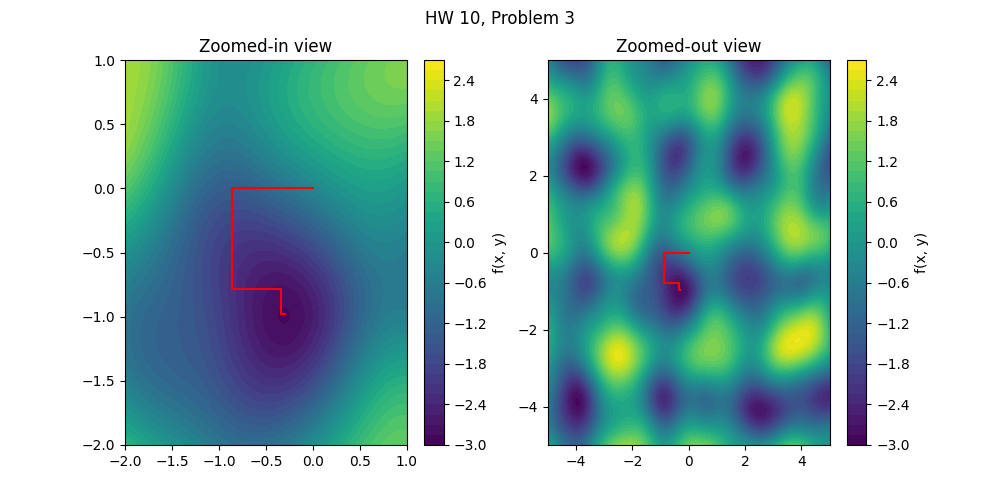

---
---

# HW 10

* Table of Contents
{:toc}

## Summary

**Due Date**: Wed, Nov 19 at midnight  
**What to submit**:
- A single PDF file containing:
  - The plots from (1.2)
  - The plot from (1.3)
  - Your solution to problem (2)
  - The plots from problem (3.2)
- Python files:
  - A file containing all your code from problem (1).
  - A file containing all your code from problem (3).   

**Where to submit**:  
- PDF at [this link](https://moodle.swarthmore.edu/mod/lti/view.php?id=772868)
- Code at [this link](https://moodle.swarthmore.edu/mod/lti/view.php?id=772866)

## (1) Golden Section Search in Python

**What to turn in:** Code for (1.1), (1.2) and (1.3), PDF for (1.2) and (1.3)

### (1.1) Write a program

Write a program that uses the Golden Section Search algorithm to find either a maximum or a minimum of the function $f(x)$. Your function should accept, as one of its arguments, the string `max` or `min`, and should correspondingly try to maximize or minimize $f(x)$.

Your program should accept the following arguments:
- a function, which is to be optimized
- Two real numbers `a` and `b`, corresponding to the left-ward and right-ward edges of the region which is to be searched for an optimum,
- a parameter `tol`, which in practice will be a small number such as `1e-6` or similar.
- a string, which --- if the program is used correctly --- should either be `max` or `min`.

### (1.2) Use your program to solve optimization problems

Test your program by finding two different minima and two different maxima of the following function. Illustrate that you have done this correctly by generating a plot of the function together with points indicating the minima and maxima that you find.

~~~python
import numpy as np

def f1(x): return np.exp(-0.5*x)*np.sin(x))
~~~

Also test your program by finding all the turning point of the following function. Illustrate that you have done this correctly by generating a plot of the function together with points indicating the extrema you have found.

~~~python
import numpy as np

def f2(x): return 2*(x**2)*(x-np.exp(0.1*x))**2
~~~

### (1.3) Document the rate at which the interval size decreases

For either one of the examples above, generate a plot of $h$, which is the interval size, against the step number on a log-log scale. Do this with as low a value of the `tolerance` parameter as you are able to use, i.e., try to get $h$ down to as small a number as you can.

## (2) Constraints

**What to turn in:** PDF only  

While solving a 3-dimensional optimization problem involvingthe minimization of the function $$f(x,y,z) = ...$$ you are required to look for solutions {x,y,z} that exist on the surface of a sphere centered at the point $(1,1,0)$ having radius $2$. Assuming the function $f(x,y,z)$ is some known function of three variables, write down the function that you would minimize instead of $f$ in order to meet the constraint.

## (3) Naive n-dimensional optimization

**What to turn in:** Code for (3.1) and (3.2), PDF for (3.2)

### (3.1) Write a function that minimizes 2-dimensional functions

Write a function that implements naive n-dimensional optimization of a given function $f$. You should assume throughout this problem that $n=2$. As stated during the in-class activity, your function must take as input: 
- the function $f$ to be minimized
- A guess consisting of a point [x,y]
- A set of 2 direction vectors, each of size 2x1
- A tolerance parameter that terminates the search when $ || x_{n+1}-x_{n} || $ is lower than a certain threshold.

Your function should return a history of all of the pairs $(x_i,y_i)$ from $i=1$ to $i=m$, where $m$ is the total number of steps that your algorithm took when looking for a minimum. It is up to you how to format the output of your function. For example, you can return an $m$-elements long list of 2x1 `numpy` arrays, or you can return a two-dimensional `numpy` array of size 2xm or mx2.

### (3.2) Apply your function

For each of the following sub-tasks, you must produce a plot to submit as part of your PDF and you must also turn in your code. For tasks 3-6, when you illustrate your result, make **two** plots: one should show a zoomed-in picture where the action is happening, and one should show a bigger-picture look at the function's behavior.

1. Use your function to solve the optimization problem from HW 9, using the same direction vectors and initial guess. Use a relatively high tolerance, such as `1e-4`.
2. Use your function to solve the optimization problem from HW 9, using the same initial guess but different direction vectors. You may choose any two directions.
3. Use your function to optimize the noisy function included below, starting from the point $(0,0)$ using the directions `[0.5,1]` and `[0,1]`. When you illustrate your result, make **two** plots: one should show a zoomed-in picture where the action is happening, and one should show a bigger-picture look at the function's behavior. For this and the subsequent tasks, use the following parameters when setting up the noisy function: `make_noisy_function(n=2, noise_amp=3.1, sigma=12)`
4. For the same starting point as above, choose a different set of direction vectors than above, and show your results.
5. Choose a different starting point and direction vectors of your own choice. Show your results.
6. Find the minimum of the noisy function that lives on a circle of radius 3 centered at the origin.

#### Constructing the noisy function
For tasks 3-6 above, you will make use of a custom function, which we have been calling the 'noisy function'. This function is an artificially-constructed one that has some elements of periodicity and some elements of randomness; these combine to make a less-straightforward optimization problem than the ones you've been looking at so far. You **do not have to write this function**; it is provided below. 

~~~python
import numpy as np
from scipy.ndimage import gaussian_filter
from scipy.interpolate import RegularGridInterpolator
import matplotlib.pyplot as plt

def make_noisy_function(n=2, noise_amp=1.0, sigma=10, 
                        xlim=(-10,10), ylim=(-10,10), 
                        resolution=500):
    # This function takes as argument some optional parameters
    # and returns a Python function. So if you run `f = make_noisy_function()`
    # then f will become a function of two variables, i.e., `f(x,y)`.
    # This is an interesting function to minimize. 
    
    # Base grid
    x = np.linspace(*xlim, resolution)
    y = np.linspace(*ylim, resolution)
    X, Y = np.meshgrid(x, y)

    # Base function
    Z = np.sin(n*X) + np.sin(n*Y)

    # Smooth noise
    noise = np.random.randn(*Z.shape)
    smooth_noise = gaussian_filter(noise, sigma=sigma)
    smooth_noise /= np.max(np.abs(smooth_noise))  # normalize to [-1,1]

    # Add noise
    Z_noisy = Z + noise_amp * smooth_noise

    # Interpolator turns it into a callable function f(x, y)
    f_interp = RegularGridInterpolator((x, y), Z_noisy, bounds_error=False, fill_value=None)

    def f(x, y=None):
        if y is None:
            # function has been passed with one argument.
            # Treat that argument as a vector [x,y]
            pts = x
        else:
            # function has been passed with two arguments.
            # Treat them as x and y.
            x = np.atleast_1d(x)
            y = np.atleast_1d(y)
            pts = np.column_stack([x, y])
        vals = f_interp(pts)
        if vals.size == 1:
            return vals.item()
        else:
            return vals

    return f

# How to use the above 'constructor function':
test_function = make_noisy_function(n=5, noise_amp=0.1, sigma=10)
~~~

The code above creates a function called `test_function`, which you can now make use of. This is the function to be minimized in tasks 3-6.

#### Sample results

The required plots can be made using code such as that included below. You are welcome to adapt this code for your work.

~~~python
figure1, (axes1, axes2) = plt.subplots(1,2,figsize=(10,5))

figure1.figsize = (10,5)
figure1.suptitle('HW 10, Problem 3')

contour1 = axes1.contourf(X, Y, Z, levels=40)
plt.colorbar(contour1, label='f(x, y)')
axes1.set_xlim(left=-2,right=1)
axes1.set_ylim(bottom=-2,top=1)
axes1.plot(hist1[:,0],hist1[:,1],color='red')
axes1.set_title('Zoomed-in view')

contour2 = axes2.contourf(X, Y, Z, levels=40)
plt.colorbar(contour2, label='f(x, y)')
axes2.plot(hist1[:,0],hist1[:,1],color='red')
axes2.set_title('Zoomed-out view')

plt.show()
~~~


