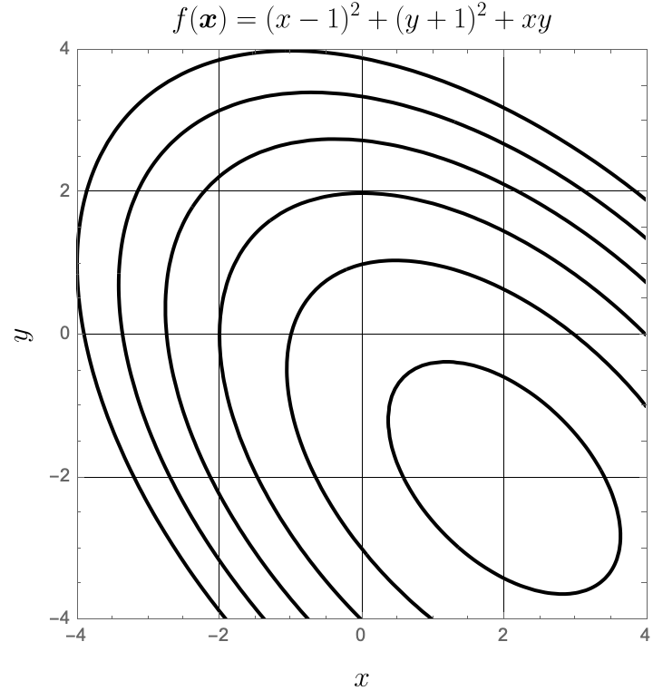

---
---

# HW 10

* Table of Contents
{:toc}

## Summary

**Due Date**: Tue, Nov 11 at midnight  
**What to submit**:
- A single PDF file
**Where to submit**:
- PDF at [this link]()

## (1) Golden Section Search in Python

### (1.1) Write a program

Write a program that uses the Golden Section Search algorithm to find either a maximum or a minimum of the function $f(x)$. Your function should accept, as one of its arguments, the string `max` or `min`, and should correspondingly try to maximize or minimize $f(x)$.

Your program should accept the following arguments:
- a function, which is to be optimized
- Two real numbers `a` and `b`, corresponding to the left-ward and right-ward edges of the region which is to be searched for an optimum,
- a parameter `tol`, which in practice will be a small number such as `1e-6` or similar.
- a string, which --- if the program is used correctly --- should either be `max` or `min`.

### (1.2) Use your program to solve optimization problems

Test your program by finding two different minima and two different maxima of the following function. Illustrate that you have done this correctly by generating a plot of the function together with points indicating the minima and maxima that you find.

~~~python
import numpy as np

def f1(x): return np.exp(-0.5*x)*np.sin(x))
~~~

Also test your program by finding all the turning point of the following function. Illustrate that you have done this correctly by generating a plot of the function together with points indicating the extrema you have found.

~~~python
import numpy as np

def f2(x): return 2*(x**2)*(x-np.exp(0.1*x))**2
~~~

### (1.3) Document the rate at which the interval size decreases

For either one of the examples above, generate a plot of $h$, which is the interval size, against the step number on a log-log scale. Do this with as low a value of the `tolerance` parameter as you are able to use, i.e., try to get $h$ down to as small a number as you can.

## (1) Golden Section Search

### (1.1) By hand

Use the Golden Section Search Method to locate the maximum of the function $$f(x) = -x^6 - 2 x^4 - 3 x^1 + 1$$ between $x=-1$ and $x=0.5$. There is only one such maximum. Do this by filling out the following table up to the number of rows indicated, either by hand or electronically by downloading the $\LaTeX$ [template](GoldenSectionSearch.tex).

<embed src="GoldenSectionSearch.pdf" width="500" height="375"
 type="application/pdf">

### (1.2) Pseudo-code

If you were to write a program that accomplishes what you did by hand in the previous part, what would you tell the program to do? Now that you are familiar with writing code for numerical methods in Python, write down the steps that you would ask the computer to take if you started with a bracket within which you know that a single root exists. Write your "program" in the form of a function that takes as input

1. the function to be maximized, $f(x)$;
2. the left and right edges of the bracket within which you know a maximum occurs. Call these $a$ and $b$.
3. the required size of the final interval within which the solution should be bracketed, $\varepsilon$.

The output of your function should be the $x$-value of the  midpoint of the final interval. This is your estimate of the maximum of $f(x)$.

**Note**  
Pseudo-code can range from syntactically correct Python to plain English; don't worry about exactly how to write it, as long as you get the general idea across. The common element is that pseudo-code should have the same *structure* as actual code, by indicating 'for' and 'while' loops as well as 'if statements', and should be appropriately indented to indicate the code that takes place under a certain loop or inside a certain 'if' or 'else' block.

## (2) Naive multi-dimensional optimization

### (2.1) Working out the steps by hand

 Minimize the function $$ f(\boldsymbol{x}) = f(x,y) = (x-1)^2 + (y+1)^2 + xy \label{fmin}
$$
using naive $n$-dimensional optimization by hand for four steps, cycling through the direction vectors
$$
\boldsymbol{v_1} = \begin{bmatrix} 1 \\ 1\end{bmatrix}, \quad \boldsymbol{v_2} = \begin{bmatrix} 0 \\ 1 \end{bmatrix},
$$
starting with the guess 
$$
\boldsymbol{x_0} = \begin{bmatrix} x_0  \\ y_0 \end{bmatrix} = \begin{bmatrix} -1 \\ 2 \end{bmatrix}.
$$
This function is simple enough that you should not need to use an optimization program to carry out each of the 1-dimensional optimizations; instead, you should be able to do these by hand using single-variable calculus.

At each step, calculate the 'true relative error' in $\boldsymbol{x}$ by comparing against the correct value of the minimum, and the `approximate relative error' by comparing against the previously-computed value (i.e., compare step 1 against step 0, step 2 against step 1, etc.). These errors can be calculated using the following definitions:

$$\text{True relative error } = \frac{\left \lVert \boldsymbol{x} - \boldsymbol{x}_{\text{true}} \right \rVert }{ \left \lVert \boldsymbol{x}_{\text{true}} \right\rVert} , \text{ and}$$

$$\text{Approximate relative error } = \frac{ \left\lVert \boldsymbol{x}_{\text{current}} - \boldsymbol{x}_{\text{previous}} \right \rVert}{ \left \lVert \boldsymbol{x}_{\text{previous}} \right \rVert}.
$$

Note that you can find the correct answer by solving a math problem; take derivatives of $f$ with respect to $x$ and $y$, equate them to zero, and solve the resulting equations 'by hand'.

Also, recall that the norm of a vector is $\left \lVert \boldsymbol{x} \right \rVert = \sqrt{x_1^2+x_2^2 + ... + x_n^2}$

Tabulate your results in the follwing format (there is no need to use square-root symbols though):

|                  | Step 0       | Step 1 | Step 2 | Step 3 | Step 4 |
|------------------|--------------|--------|--------|--------|--------|
| \( x \)         | \(-1\)       |        |        |        |        |
| \( y \)         | \(\phantom{-}2\)        |        |        |        |        |
| \( f(x,y) \)    | \(11\)       |        |        |        |        |
| True relative error | \( \frac{5}{\sqrt{8}} \approx 1.768 \) |        |        |        |        |
| Approx. relative error |N/A        |        |        |        |        |

### (2.2) Illustrate

Illustrate

Illustrate the steps from the previous problem graphically on the following plot, which shows contours of $f(\boldsymbol{x})$. Label the points $\boldsymbol{x}_0$ through $\boldsymbol{x}_4$, as well as the direction vectors $\boldsymbol{v}_1$ and $\boldsymbol{v}_2$ drawn at the appropriate locations. Altogether, you will have five points connected by four lines: two lines will have the direction of $\boldsymbol{v}_1$ and two will have the direction of $\boldsymbol{v}_2$. You may either use repeated labels or label the successive directions $[\boldsymbol{v}_1, \boldsymbol{v}_2, \boldsymbol{v}_3, \boldsymbol{v}_4]$


