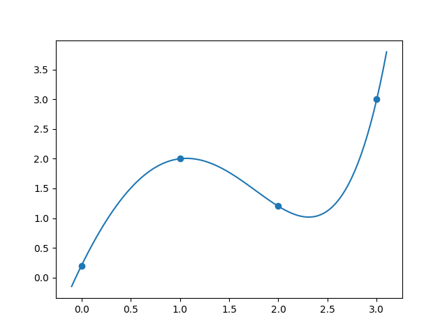
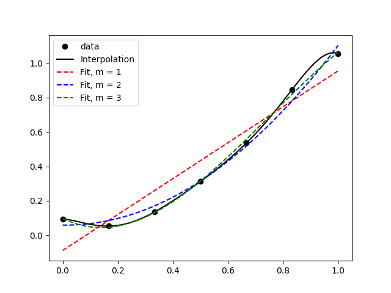
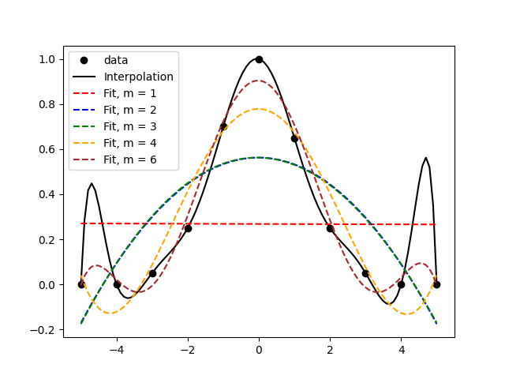

---
---

# HW 11 Solutions

* Table of Contents
{:toc}

[HW 11 Questions](HW11)

## (1) Polynomial Interpolation

### (1.1) Set up the linear system of equations

~~~python
def interpolation_system(x_values,y_values):
    n = len(x_values)
    A = np.zeros((n,n))
    b = np.zeros((n,))
    for row in range(n):
        for col in range(n):
            summation = 0
            for k in range(n):
                summation += x_values[k]**(row+col)
            A[row,col] = summation
    for row in range(n):
        summation = 0
        for k in range(n):
            summation += y_values[k] * x_values[k]**row
        b[row] = summation
    return A,b
~~~

### (1.2) Solve the linear system for the data provided

To do this, it is sufficient to write:

~~~python
import numpy as np
from numpy.linalg import solve

data = np.loadtxt("interpolate_these.txt")
x_vals = data[:,0]
y_vals = data[:,1]

AA,bb = interpolation_system(x_vals,y_vals)
coeffs = solve(AA,bb)
~~~

### (1.3) Assemble an interpolating function that uses these coefficients

If you read the documentation of [`numpy.polyval`](https://numpy.org/doc/stable/reference/generated/numpy.polyval.html) you will see that it expects, as its first argument, an array of coefficients. However, `polyval` expects the array of coefficients `p` to be ordered in the form 

~~~
p[0]*x**(N-1) + p[1]*x**(N-2) + ... + p[N-2]*x + p[N-1]
~~~
i.e., the coefficient of the highest power of $x$ is first, and the coefficient of the second-highest power of $x$ is second, ... and the last element of `p` is supposed to be the constant coefficient (a.k.a. the y-intercept). This is opposite to the convention that we used when we ordered our vector of unkonwns, so we need to 'flip' it. That's all you had to do in this question!

~~~python
def interpolating_polynomial(x,array_a):
    # Thin wrapper around polyval
    return np.polyval(np.flip(array_a),x)
~~~

It is also possible to write this out more fully and to not make use of `polyval` at all. 

### (1.4) Make a plot showing the data points and the interpolation

You already know what this was supposed to look like.

## (2) Polynomial curve-fit using least-squares

### (2.1) A function for generating the linear system

~~~python
def curvefit_system(x_values,y_values,m):
    n = len(x_values)
    A = np.zeros((m+1,m+1))
    b = np.zeros((m+1,))
    for row in range(m+1):
        for col in range(m+1):
            # There is a summation for each term.
            summation = 0
            for k in range(n):
                summation += x_values[k]**(row+col)
            A[row,col] = summation
    for row in range(m+1):
        # There is a summation for each term.
        summation = 0
        for k in range(n):
            summation += y_values[k]*x_values[k]**row
        b[row] = summation
    return A,b
~~~

### (2.2) Solve the linear system for the data provided, using $m=2$

~~~python
import numpy as np
from numpy.linalg import solve

data = np.loadtxt("datapoints.txt")
x_vals = data[:,0]
y_vals = data[:,1]
M = 2               # fit quadratic curve to this data

mat,rhs = curvefit_system(x_vals,y_vals,M)
coeffs = solve(mat,rhs)
~~~

### (2.3) Assemble a curve-fit function that uses the coefficients

The task here is pretty much identical to the task in (1.3). We will do it by writing a wrapper around `polyval` like before.

~~~python
def interpolating_polynomial(x,array_a):
    # Thin wrapper around polyval
    return np.polyval(np.flip(array_a),x)
~~~

### (2.4) Make a plot

You already know what this was supposed to look like.

## (3) Interpolation with non-polynomial functions

The equations to be used here are:

$$ 0.2 = a + b e^{0.0} + c (0.0)^2 + d \sin 0.0$$

$$ 2.0 = a + b e^{1.0} + c (1.0)^2 + d \sin 1.0$$

$$ 1.2 = a + b e^{2.0} + c (2.0)^2 + d \sin 2.0$$

$$ 3.0 = a + b e^{3.0} + c (3.0)^2 + d \sin 3.0$$

As a linear system, this will look like:

$$
\begin{bmatrix}
1 & 1 & 0 & 0 \\
1 & e & 1^2 & \sin 1 \\
1 & e^2 & 2^2 & \sin 2 \\
1 & e^3 & 3^2 & \sin 3
\end{bmatrix}
\begin{bmatrix}
a \\
b \\
c \\
d
\end{bmatrix}
=
\begin{bmatrix}
0.2 \\
2.0 \\
1.2 \\
3.0
\end{bmatrix}
$$

Solving this system, we get the solution:

$$ a = -0.8534, b = 1.0534, c = -1.9592, d = -2.3162.$$

To check that this is correct, we can plot the function $$f(x) = a + b e^{x} + cx^2 + d \sin x$$ using the above values for $a,b,c,d$.

The end result is:

and the code to produce this is 

~~~python
import numpy as np
from numpy import exp,sin
import matplotlib.pyplot as plt
from numpy.linalg import solve

# Points
xp = np.array([0.0,1.0,2.0,3.0])
yp = np.array([0.2,2.0,1.2,3.0])

# Set up the matrix of coefficients
A = np.array([[1,np.exp(0),0**2,np.sin(0.0)],
              [1,np.exp(1),1**2,np.sin(1.0)],
              [1,np.exp(2),2**2,np.sin(2.0)],
              [1,np.exp(3),3**2,np.sin(3.0)]
              ])

# Set up the right hand side
rhs = np.array([[0.2],
                [2.0],
                [1.2],
                [3.0]
                ])

# Solve for a,b,c and d.
abcd = solve(A,rhs)

# Define the interpolating function:

def f1(x,coeffs):
    a,b,c,d = coeffs
    return a + b*exp(x) + c*(x**2) + d*sin(x)

# Create a 'continuous' array of x and y values
# to plot. x should be evenly spaced and y should
# arise from the above function `f1`
xs = np.linspace(-0.1,3.1,100)
ys = f1(xs,abcd)

plt.scatter(xp,yp)
plt.plot(xs,ys)
plt.savefig("nonpolynomialinterpolation.png")
~~~

## (4) Evaluating Curve fits

### The first one

In the above figure, it's clear that the data is generally increasing, so the linear fit does a good job of capturing the most basic feature, but it's not quite capable of showing the dip before the increase. The quadratic fit doesn't do much better, and the cubic fit nicely captures most of the data and pretty much looks like an interpolation.

### The second one

In the above figure, we find that the interpolation involves some weird features like the peaks between the first and second, and between the second-last and last, data points. A cursory look at the data alone would suggest that the black line isn't really capturing any 'trend' there. This is what's called 'over-fitting' and it's what happens when there are too many parameters in your 'curve-fit'. Note that an interpolation is a special case of a curve fit. Thus, it would probably make sense to choose a low-order polynomial to fit the data. Visually, I think `m=3` does an okay job because it avoids the extra peaks and troughs. `m=6` isn't too bad either, because its peaks and troughs are quite attenuated and it does a better job of approximating the data.


