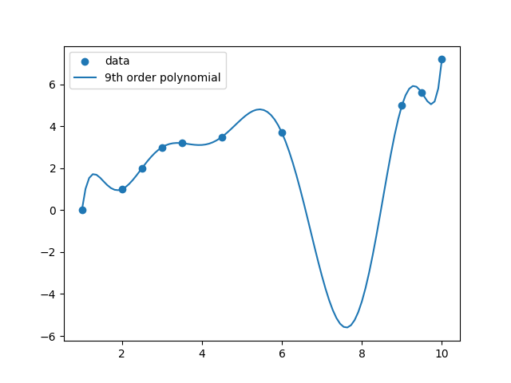
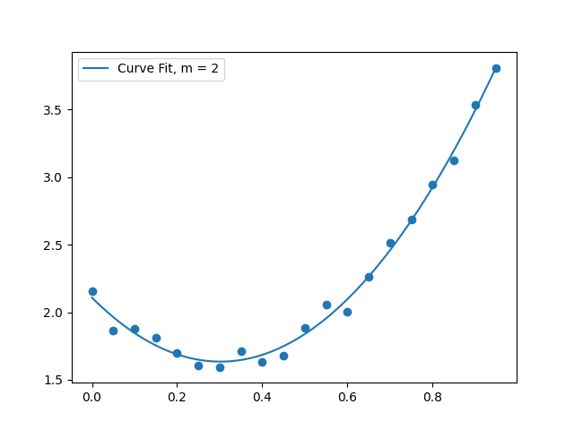

---
---

# HW 11

* Table of Contents
{:toc}

## Summary

**Due Date**: Tuesday after Thanksgiving  
**What to submit**:
- A single Python file called `interpolation.py` for problem 1.
- A single Python file called `curvefit.py` for problem 2
- A PDF file containing your answers to problem (3) and problem (4). No code for (3) and (4).

**Where to submit**:  
- PDF at [this link](https://moodle.swarthmore.edu/mod/lti/view.php?id=773667)
- Code at [this link](https://moodle.swarthmore.edu/mod/lti/view.php?id=773652)

## (1) Polynomial Interpolation

In class, we derived a linear system of equations for finding the coefficients of an order-$n$ polynomial that interpolates between (i.e., passes through) $n+1$ points.

**Instructions**

You will submit a single Python file for this problem. Put your import statements and function definitions at the top of the file, and write the rest of your code underneath. The graders should be able to run your file as-is.

### (1.1) Set up the linear system of equations

Write a Python function that takes as input an array of x-values and an array of y-values, representing ordered pairs $(x_i,y_i)$, and returns (1) the system matrix, and (2) the right-hand-side vector, from slide 8 of lecture 15.
~~~python
def interpolation_system(x_values,y_values):
	# x_values and y_values should be 1-dimensional arrays of the same size.
	num = len(x_values)
	A = np.zeros((num,num))
	b = np.zeros(num)
	return A,b
~~~

### (1.2) Solve the linear system for the data provided

Download the [text file named `interpolate_these.txt`](../Resources/interpolate_these.txt) from the Resources page. Write Python code that

1. Loads the data from this text file using `numpy.loadtxt()`
2.  Assigns the columns of the text file to two separate 10-element `numpy` arrays, named, e.g., `x_data` and `y_data`
3.  Calls your function `interpolation_system` from above and stores the matrix and right-hand side.
4. Uses the `numpy` function [`numpy.linalg.solve`](https://numpy.org/doc/stable/reference/generated/numpy.linalg.solve.html) to solve the system of equations $Ax=b$, where $A$ is the matrix from `interpolation_system` and $b$ is the right-hand side from `interpolation_system`. Here, $x$, the unknown vector, contains the coefficients of our sought-for polynomial, $\{ a_0, a_1, a_2, ..., a_n \}$.

### (1.3) Assemble an interpolating function that uses the coefficients

Now that you have found coefficients $\{ a_0, a_1, a_2, ..., a_n \}$ that define the $n$-degree polynomial that interpolates between these points, write a new function that evaluates this polynomial for any $x$.

Recall that the mathematical form of this interpolating function is $$f(x; a_0, a_1, ..., a_n) = a_0 + a_1 x + a_2 x^2 + a_3 x^3 + ...$$

Your task is to write a Python function that evaluates this interpolating function at any value of $x$, for any given set of coefficients $\{ a_0, a_1, a_2, ..., a_n \}$.

~~~python
def interpolating_polynomial(x,array_a):
	# x can be any real number (NOT an array)
	# array_a will be an array containing the coefficients
	# of the order-n polynomial: a_0, a_1, a_2, etc.
	# the function should return 
	# a_0*x^0 + a_1*x^1 + a_2*x^2 + ... a_n*x^m
	return 0.0
~~~

**Note:** Note that `numpy` already contains a function that does essentially this; it's called [`numpy.polyval`](https://numpy.org/doc/stable/reference/generated/numpy.polyval.html). You may choose to implement this task as a  ['wrapper'](https://en.wikipedia.org/wiki/Wrapper_function) around `polyval`. It should be straightforward to write your own code without using `polyval`, too.

**Also Note:** This function will be generic; it won't contain any information from problem 1.1 or problem 1.2. Later, when you *call* the function, you'll provide information about what exactly the coefficients are --- and they will be the ones you found in problem 1.2.

### (1.4) Make a plot showing the data points and the interpolation
Generate a plot that shows the data points together with the interpolating curve. The following snippets of code will help you with this.

~~~python
import numpy as np
import matplotlib.pyplot as plt

# Assuming x_vals, y_vals contains the coordinates
# of the data points:
plt.scatter(x_vals,y_vals)

# Assuming you have solved 1.2 and you have an array
# of coefficients [a_0, a_1, a_2, ..., a_n] called "a" 
# found after solving the linear system in problem 1.2:

# Generate 100 x-values between the first and last coordinate
x_continuous = np.linspace(x_vals[0],x_vals[-1],100)

# Evaluate your interpolating function at all 100 points
y_continuous = interpolating_polynomial(x_continuous,a)

# Make a line plot
plt.plot(x_continuos,y_continuous,label='Interpolating func')
plt.legend()

# Save it
plt.savefig("interpolation.png")

# Show the plot
plt.show()
~~~

Your plot should look substantially similar to the one below.

## (2) Polynomial curve fit using least-squares

In class, we saw that the linear system for finding a best-fit curve takes the following form:

**Instructions** 

You will submit a single Python file for this problem. Put your import statements and function definitions at the top of the file, and write the rest of your code underneath. The graders should be able to run your file as-is.

### (2.1) A function for generating the linear system
Complete the activity from class, i.e., write a Python function that takes as input an array of x values, an array of y values, and an integer $m$, where $m$ is the order of the polynomial that is to be fit to the data. The function should return a matrix of size $(m+1) \times (m+1)$ and an array of size $m+1$.

~~~python
def curvefit_system(x_values,y_values,m):
	# x_values and y_values should be 1-dimensional arrays of the same size.
	A = np.zeros((m+1,m+1))
	b = np.zeros(m+1)
	return A,b
~~~

### (2.2) Solve the linear system for the data provided using $m = 2$

Download the [text file](../Resources/datapoints.txt) that was introduced in class. Write Python code that

1. Loads the data from this text file using `numpy.loadtxt()`
2.  Assigns the columns of the text file to two separate 10-element `numpy` arrays, named, e.g., `x_data` and `y_data`
3.  Calls your function `curvefit_system` from above, with `m=2`, and stores the matrix and right-hand side.
4. Uses the `numpy` function [`numpy.linalg.solve`](https://numpy.org/doc/stable/reference/generated/numpy.linalg.solve.html) to solve the system of equations $Ax=b$, where $A$ is the matrix from `curvefit_system` and $b$ is the right-hand side from `curvefit_system`. Here, $x$, the unknown vector, contains the coefficients of our sought-for polynomial, $\{ a_0, a_1, a_2, ..., a_m \}$.

### (2.3) Assemble a curve-fit function that uses the coefficients

Now that you have found coefficients $\{ a_0, a_1, a_2, ..., a_m \}$ that define the $m$-degree polynomial that best fits these points, write a new function that evaluates this polynomial for any $x$.

Recall that the mathematical form of this polynomial function is $$f(x; a_0, a_1, ..., a_m) = a_0 + a_1 x + a_2 x^2 + a_3 x^3 + ...$$

Your task is to write a Python function that evaluates this function at any value of $x$, for any given set of coefficients $\{ a_0, a_1, a_2, ..., a_m \}$.

~~~python
def curvefit_polynomial(x,array_a):
	# x can be any real number (NOT an array)
	# array_a will be an array containing the coefficients
	# of the order-m polynomial: a_0, a_1, a_2, etc.
	# the function should return 
	# a_0*x^0 + a_1*x^1 + a_2*x^2 + ... a_m*x^m
	return 0.0
~~~

**Note:**  `numpy` already contains a function that does essentially this; it's called [`numpy.polyval`](https://numpy.org/doc/stable/reference/generated/numpy.polyval.html). You may choose to implement this task as a  ['wrapper'](https://en.wikipedia.org/wiki/Wrapper_function) around `polyval`. It should be straightforward to write your own code without using `polyval`, too.

**Note:** This function will be generic; it won't contain any information from problem 2.1 or problem 2.2. Later, when you *call* the function, you'll provide information about what exactly the coefficients are --- and they will be the ones you found in problem 2.2.
 
### (2.4) Make a plot showing the data points with a quadratic curve fit

Generate a plot that shows the data points together with a quadratic best-fit curve. The following snippets of code will help you with this.

~~~python
import numpy as np
import matplotlib.pyplot as plt

# Assuming x_vals, y_vals contains the coordinates
# of the data points:
plt.scatter(x_vals,y_vals)

# Assuming you have solved 2.2 and you have an array
# of coefficients [a_0, a_1, a_2, ..., a_m] called "a" 
# found after solving the linear system in problem 2.2:

# Generate 100 x-values between the first and last coordinate
x_continuous = np.linspace(x_vals[0],x_vals[-1],100)

# Evaluate your interpolating function at all 100 points
y_continuous = curvefit_polynomial(x_continuous,a)

# Make a line plot
plt.plot(x_continuos,y_continuous,label='Best Fit')
plt.legend()

# Save it
plt.savefig("bestfit.png")

# Show the plot
plt.show()
~~~

Your plot should look substantially similar to the one below.

## (3)  Interpolation with non-polynomial functions

**Note:**  This problem is to be turned in as a PDF, NOT as code.
    
Find the values of coefficients $\{a,b,c,d\}$ such that the function $$f(x) = a + b e^{x} + cx^2 + d \sin x$$ passes through the points

| x | y |
|---|---|
| 0.0| 0.2  |
| 1.0 | 2.0 |
| 2.0 | 1.2 |
| 3.0 | 3.0 |

using the following procedure

1. Write down the equations that must be solved, in terms of $a$, $b$, $c$ and $d$.
2. Arrange the equations in the form of a linear system $Ax=b$, where $x$ is a vector containing the unknown parameters $[a,b,c,d]$.
3. You should now have a matrix and a right-hand side vector. Use any method you like to find the solution to this linear system. e.g., you can use `numpy.linalg.solve`, or you can use Gaussian elimination, etc.
4. Report the results as numbers, e.g., $a = 1.23, b = 4.56,...$ etc.

Turn in all of your work as part of the PDF submission for this HW.

**Note:** To get full credit, your values of a, b, c and d must be correct. You can check whether they are by plotting $f(x)$ and ensuring it passes through the points given.

## (4) Evaluating curve fits

Download the files [`data1.csv`](data1.csv) and [`data2.csv`](data2.csv), as well as the Python files [`newtonPoly.py`](newtonPoly.py) and [`polyFit.py`](polyFit.py).

- `newtonPoly.py` uses Newton's polynomial to determine the (unique) interpolating polynomial that connects a set of points together. Newton's polynomial is a technique for interpolating between points with a polynomial curve. Since polynomial interpolation is typically unique, Newton's method of finding a polynomial is equivalent to the method that you used in problem 1. You are provided all of the code needed to use Newton's method for interpolation, so you should not need to write much code for problem 4. You can read about Newton's polynomial interpolation technique [here](newtonpoly.pdf).
- `polyFit.py` implements a curve-fitting procedure using ap olynomial of a specified degree.

Your task is to perform polynomial interpolation as well as polynomial curve-fitting on the two given sets of data.

**Note:** No modifications whatsoever are needed in `newtonPoly.py` or `polyFit.py`.

**Note:** You will not turn in the code for this problem.

###  Data set 1

Make a single plot that contains:
- Scatter plot of the data points
- The (unique) polynomial interpolation between all the points, and
- Three additional curves, representing polynomial curve fits of degree 1, 2 and 3 (linear, quadratic and cubic).

Use the following code to get started.

~~~python
# Import functions. Make sure that your downloaded files are in the present working directory.
import numpy as np
from newtonPoly import coeffts, evalPoly
from polyFit import polyFit, evalPolyFit
import matplotlib.pyplot as plt

x1 = np.loadtxt('data1.csv')[:,0]
y1 = np.loadtxt('data1.csv')[:,1]

# Create x-axis to plot
xs = np.linspace(x1[0],x1[-1],100)

# Find coefficients of Newton's Polynomial (interpolation)
a = coeffts(x1,y1)

# Evaluate Newton's polynomial at values 'xs'
y_interp = evalPoly(a,x1,xs)

# Curve fit using polynomials of different degrees.
b1 = polyFit(x1,y1,1)
b2 = polyFit(x1,y1,2)

# Evaluate curve-fit at values 'xs'
y_curvefit1 = evalPolyFit(xs,y1,b1)
y_curvefit2 = evalPolyFit(xs,y1,b2)

# Make plot
plt.plot(x1,y1,'o',label='data',color='black')
plt.plot(xs,y_interp,'-',label='Interpolation',color='black')
plt.plot(xs,y_curvefit1,'r--',label='Fit, m = 1')
plt.plot(xs,y_curvefit2,'b--',label='Fit, m = 2')
plt.legend()
plt.show()
~~~

Turn in your resulting plot.

### Data set 2

Make a single plot that contains:
- Scatter plot of the data points
- The (unique) polynomial interpolation between all the points, and
- Five additional curves, representing polynomial curve fits of degree 1, 2, 3, 4 and 6.

Use the following code to get started:

~~~python
# Generate data
import numpy as np
from newtonPoly import coeffts, evalPoly
from polyFit import polyFit, evalPolyFit
import matplotlib.pyplot as plt

x1 = np.loadtxt('data2.csv')[:,0]
y1 = np.loadtxt('data2.csv')[:,1]

# Create x-axis to plot
xs = np.linspace(x1[0],x1[-1],100)

# Newton Polynomial (interpolation)
a = coeffts(x1,y1)

# Evaluate Newton's polynomial at values 'xs'
y_interp = evalPoly(a,x1,xs)

# Curve fit with order m = 1
b1 = polyFit(x1,y1,1)

# Evaluate curve-fit at values 'xs'
y_curvefit1 = evalPolyFit(xs,y1,b1)

# Make plot
plt.plot(x1,y1,'o',label='data',color='black')
plt.plot(xs,y_interp,'-',label='Interpolation',color='black')
plt.plot(xs,y_curvefit1,'r--',label='Fit, m = 1')
plt.legend()
plt.show()

~~~

Turn in your resulting plot.

### Discussion

Explain which curve fit, out of the ones you have plotted, you would choose to represent each of these datasets. You should write a short paragraph each for data set 1 and data set 2.


