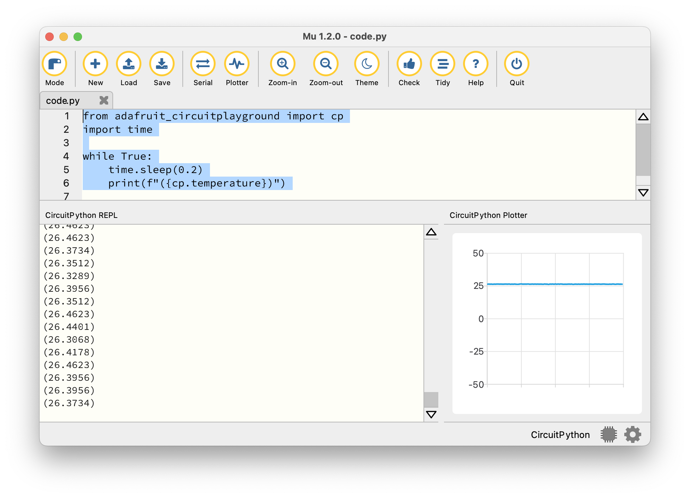
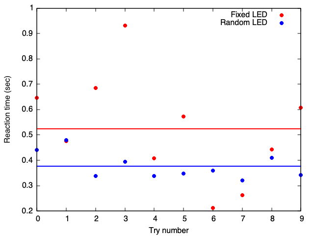

# HW 2

* Table of Contents
{:toc}


## Summary

**Due Date**: Tue, Sep 16 at midnight  
**What to submit**:  
- Problem (1): a PDF file only
- Problem (2): a file named `music.py`
- Problem (3): a file named `analog_digital_temperature.py`
- Problem (4): a PDF file _and_ a file named `reaction_times.py`

**Submit at**: [This link](https://moodle.swarthmore.edu/mod/lti/view.php?id=763898) for the PDF and [this link](https://moodle.swarthmore.edu/mod/lti/view.php?id=763897) for the code. You can see the submission pages on the course Moodle page as well.

## (1) Base Systems

For the problems in this section, you must turn in a PDF. It can be either handwritten or typed. 

For full credit, **show how you arrived at your answers**, don't just write the correct answers!

### Decimal / Binary

#### Convert the following integers from decimal to binary:
* `100`
* `59`
* `250`
* `476`

#### Conver the following integers from binary to decimal:
* `0b110001`
* `0b1000001`
* `0b1010101011`

### Decimal / Hexadecimal

#### Convert the following integers from decimal to hexadecimal:
* `1000`
* `597`
* `42678`
* `250`

#### Convert the following integers from hexadecimal to decimal:
* `0x14E3`
* `0xA10B`
* `0x1000`
* `0x1010`

### Addition and multiplication of numbers
In grade school, you learned how to add two multi-digit numbers by hand. In case, you've forgotten, [here's](https://www.youtube.com/watch?v=mAvuom42NyY) a video explaining this to elementary school students.

Your task in this problem is to explain how the same concept of 'carrying over' a digit (perhaps you learned the term 'regrouping') applies to binary and hexadecimal numbers. Write out, by hand,

1. The sum `0b110001` + `0b11011`
2. The sum `0b1001110` + `0b1101`
3. The sum `0xAFC` + `0x115`
4. The sum `0xE5A` + `0x85A`
5. The product `0x353` times `0x3`


For each arithmetic problem you write (5 total), write down the same calculation in decimal form as well (no need to do these 'by hand'). For example, if you were showing that 

```
0b101 + 0b100 = 1001
```

then you would show the process 'by hand' as in the YouTube video above.  
In addition, you would write --- without explanation since this is not elementary school --- the line

```
5 + 4 = 9
```

You will not get credit for this problem if you simply write down correct answers. e.g., if you write down `10010 + 10111 = 101001`. You have to _show your work_!

## (2) Using `for` loops to play music

The class `music` is defined below. An object of type (or class) `music` has two attributes, or properties: 

1. pattern, which contains a pattern of notes.
2. durations, which contains the lengths of time each note is supposed to be played.

Note that both `pattern` and `durations` are lists, and they should have the same length.

Write a program that plays the note pattern `[E E F G G F E D C C D D E D D]` for the durations `[1,1,1,1,1,1,1,1,1,1,1,1,1.5,0.5,2]` using a `for` loop. Use the following 'starter code', and test your code by copying it to your board's `code.py` file and running it.

Note that the code below makes use of the following mapping table; you do not need to modify the frequency values, since they have correctly been 'hard-coded' below.

| Note | Frequency |
|---|-----|
| C | 261 |
| D | 293 |
| E | 329 |
| F | 349 |
| G | 392 |
| A | 440 |
| B | 493 |


```python
from adafruit_circuitplayground import cp

# Define a new class called 'music'
class music:
    # The class has two attributes: 'pattern' and 'duration'
    pattern = []    # contains frequency values (in Hz)
    durations = []  # contains note durations (in seconds)

# Define the attributes of sample_music. 
# [E E F G G F E D C C D D E D D]
sample_music = music()
sample_music.pattern = [330,330,349,392,392,349,330,294,262,262,294,294,330,294,294]
sample_music.durations = [1,1,1,1,1,1,1,1,1,1,1,1,1.5,0.5,2]

# Your code starts here


```


## (3) Analog vs Digital on Circuit Python Bluefruit

In this problem, you will write a CircuitPython script that will use the Circuit Python Bluefruit's temperature sensor (an _analog_ signal) to create a digitial signal if the on-board slide switch is moved to one side and an analog signal if the slide switch is moved to the other side.

To visualize this, you will use a very simple plotting program that is built into the Mu Editor. The 'Plotter' inside Mu works as follows:

If a series of numbers is printed to the console inside parantheses, that number is also simultaneously plotted on the Plotter. For example, running the following code:

```python

from adafruit_circuitplayground import cp
import time

while True:
    time.sleep(0.2)
    print(f"({cp.temperature})")

```
generates a graph of the temperature sensor's reading every `0.2` seconds. It's important to build in a delay here, or else it's hard to get out of the loop!



### Requirements

1. If the slide switch is set to one side, your code should generate a plot of the temperature in Celsius. 
2. If the slide switch is set to the other side, your code should generate a plot of 0's and 1's, with 1 if the temperature is above 30 degrees Celsius and 0 if the temperature is below 30 degree Celsius. The program should also beep at 440 Hz if the temperature is above 30 degrees, and should remain silent otherwise.

You should be able to test mode 2 by blowing hot air on the board. If you are unable to reach a temperature of 30 Celsius, you may modify the threshold value slightly.

Also, note that it should be possible to repeatedly switch between modes without your program crashing.

The graders will copy your code into their board's `code.py` and will run it. There may be small differences from board to board, but your code _should work_ when saved on a grader's board, so please test it out thoroughly on your own board!
 
## (4) Measuring your reaction time
In this problem, you will measure your own reaction time using the Circuit Playground Bluefruit. The code provided to you lights up an LED at an unpredictable time, and you are supposed to press button A on the board when you see the LED light up. The program then reports your reaction time, i.e., the time between when the LED was lit and the button was pressed.

Currently, it collects data through 5 button presses only.

~~~python

from adafruit_circuitplayground import cp
import time
import random

# Choose the number of data points to collect
N = 5

# Create a list to collect data points
data = [0] * N

# Print some information
print("Welcome to the reaction time game.")
print(f"We will collect {N} samples.")
print("Press button A when an LED lights up.")

for j in range(N):
    # Turn off all LEDs
    cp.pixels.fill((0, 0, 0))

    # Wait for a random time between 1 and 5 seconds
    random_delay = random.uniform(1, 5)
    time.sleep(random_delay)
    # Turn on a random LED (pick an index from 0 to 9)
    led_index = random.randint(0, 9)
    cp.pixels[led_index] = (0, 10, 0)  # Green LED lights up

    # Record the time the LED lights up
    start_time = time.monotonic()

    # Wait for button A press
    while not cp.button_a:
        # do nothing; keep waiting in this while loop
        pass

    # Button pressed! First, calculate the reaction time.
    reaction_time = time.monotonic() - start_time

    # Switch off the LED
    cp.pixels[led_index] = (0,0,0)

    # Print the reaction time to the serial console
    print(f"Reaction time: {reaction_time:.3f} seconds")

    # Assign data to a list
    data[j] = reaction_time

    # Pause before restarting the game
    time.sleep(2)

~~~


### Modify the program

Paste the code above into `code.py` on your device. Then, download the file [statistical_functions.py](statistical_functions.py) and place it inside your `CIRCUITPY` drive. Then, add the line `from statistical_functions import std` at the top of your `code.py` file. This imports a function `std` that calculates the standard deviation of a list of numbers.

#### Tasks

1. Modify the code so that, in addition to printing the reaction time for each press, the mean and standard deviation are also printed at the end of the data-collection process.
2. Modify the code so that, if the slide switch is set to one side, a random LED (out of the ten LEDs in a circular arrangement) lights up. If the slide switch is set to the other side, the _same_ LED lights up. Thus, there should be two _modes_ of operation: in one mode, a random LED lights up; in the other mode, the same LED lights up.
3. Modify the code so that it collects more data points --- as many as you think are appropriate to get an _accurate_ and _precise_ measurement of your reaction time.

Turn in your modified program. To do this, name the file `reaction_time.py` instead of `code.py`.

### Use the program

Run the code that you developed to collect some real-world data on reaction times. Collect a table of values in each of the two modes (random LED & fixed LED), and determine the mean and standard deviation of your collected data in both modes.

Turn in one paragraph of text, your data table, and a chart summarizing your results, and comment on whether your reaction time was different in the two modes. Also explain how precise and how accurate you think these measurements are. 

The word 'chart' can be interpreted broadly: you can take a piece of graph paper and plot some data on an appropriate set of axes, or you can use Excel, or you can use some other program that you are familiar with. The goal is to convey what you've learned about your own reaction time using this experiment, and to tell a reader what you can say about the accuracy and precision. There is no need to include your data as a separate file; everything should just be embedded into your PDF.

An example of the kind of chart that would be acceptable is shown below.



