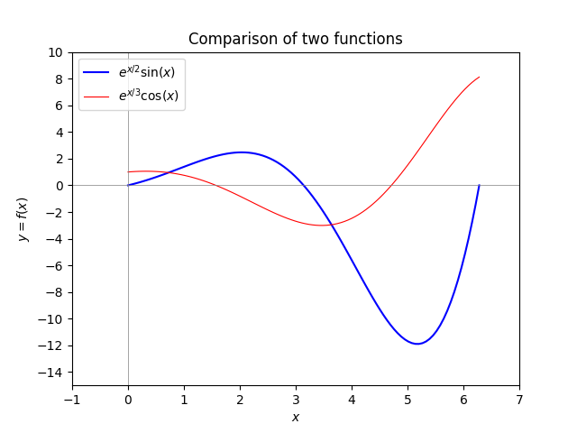
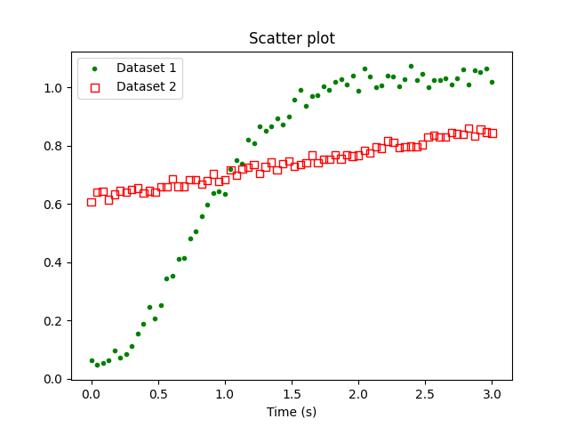

# HW 5

* Table of Contents
{:toc}

## Summary

**Due Date**: Tue, Oct 7 at midnight  
**What to submit**:  
- Problem (1): A single Python file containing all code for this problem
- Problem (2): A single Python file containing the required function definitions with correct names.
- Problem (3): A single Python file containing the required function definitions with correct names.
- Problem (4)  Two `*.png` files and two corresponding `*.py` files that, when run, reproduce the respective plots using `matplotlib.pyplot.show()`

**Submit at**: [This link](https://moodle.swarthmore.edu/mod/lti/view.php?id=766335) for the code  
And [This link](https://moodle.swarthmore.edu/mod/lti/view.php?id=766339) for the PDF.

## (1) Complete in-class activity: Numpy functions

For each of the functions from the `numpy` package named below, write a line or set of lines of code that demonstrates how this function is used. You must also write a plain-language comment before demonstrating each function, and in this comment you should write what that function does.

The list of functions is:

~~~python
numpy.array()
numpy.zeros()
numpy.ones()
numpy.empty()
numpy.arange()
numpy.linspace()
numpy.random.rand()
numpy.random.randint()
numpy.reshape()
numpy.transpose()
numpy.concatenate()
numpy.flatten()
numpy.resize()
numpy.shape()
numpy.savetxt()
numpy.loadtxt()
~~~

## (2) Working with Numpy arrays: Iteration

For each task below, you should create a function that takes as input an arbitrarily-sized 2D array. The functions need not return anything. The functions should be named as `func2_1(...), func2_2(...), func2_3(...)`, where the number after `func2_` denotes the part number in the following list.

You may wish to test out your code on arrays of arbitrary size. Initialize random arrays of specified size using the syntax
~~~python
numpy.random.randint(1,10,size=(7,10))
~~~
This will create a $7 \times 10$ array of integers between 1 and 10.

1. The `numpy.array` type is iterable, just like `list`s and `tuple`s are. Use this fact to write a `for` loop that iterates over the array that you created and prints all the *rows*.
2. The function `numpy.nditer` creates a different type of iterable when applied to an object of type `numpy.array`. Use this fact to write a `for` loop that iterates over `numpy.nditer(your array)`, and prints all the *elements*.
3. It is also possible to iterate over `numpy` arrays using the familiar `for x in range(n)` technique. Use a nested `for` loop (i.e., a total of two loops, one inside the other) to print every element in the array. It should first print out all the elements of the first row, starting from the first column (i.e., starting from the left), then all the elements of the second column, and so on.
4. Repeat 3, but this time, your function should print out the first *column* first, starting from the top; then it should move to the next column, and so on.

## (3) Working with Numpy arrays: Manipulating arrays

For this problem, please name your functions `func3_1`, `func3_2`, and `func3_3`.

1. Write a function that reverses the order of rows in a `numpy` array. The function should take an arbitarily-sized 2D array and return a 2D array of the same size.

2. Write a function that reverses the order of columns in a `numpy` array. The function should take an arbitrarily-sized 2D array and return a 2D array of the same size.

3. Write a function that takes as input argument a *square* 2D array, i.e. with shape `(n,n)` and returns as output a 1-dimensional `numpy` array of length `n` containing the diagonal elements of the 2D array.

## (4) Plotting 

### Plotting Mathematical functions in `matplotlib`

Your goal in this task is to reproduce the following figure as closely as possible.

You will turn in both a `*.png` file and a Python script (i.e., a `*.py` file that, when run, reproduces your image). Your figure should satisfy the following criteria:

Plot the two functions $$y = e^{x/2} \sin x$$ and $$y = e^{x/3} \cos x$$

over the range $x \in [0,2\pi]$.

* The y-axis range should be from -15 to 10.
* The y-axis should have tick marks at even numbers.
* The x-axis range should be from -1 to 7.
* The x-axis should have tick marks at integer intervals.
* There should be light-gray axes inside the figure, i.e. straight lines at $x=0$ and $y = 0$. These lines should have a width that is less than the width of the lines depictuing the functions.
* The function $e^{x/2}\sin(x)$ should be blue, and the function $e^{x/3}\cos(x)$ should be red.
* There should be a legend as shown.
* The two functions should be listed in the order shown in the legend.
* There should be a title
* There should be labels for the horizontal and vertical axes.
* The PNG file should be produced programmatically; you cannot just screenshot the plot.* Your Python script should include `import` commands at the top for `matplotlib.pyplot` as well as `numpy`.

### Plotting numerical data using `matplotlib`

Download [this data file](HW5_prob4_data.csv), which contains the data necessary to reproduce the following plot. Write a script in Python, making use of `matplotlib.pyplot`, that generates the following plot.

As above, you should reproduce as many features of the above plot as you can. In particular, the color and style of the markers should closely match the above figure.

