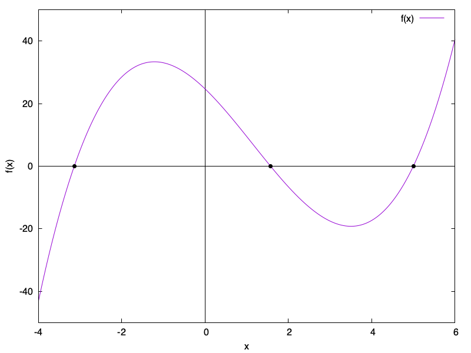
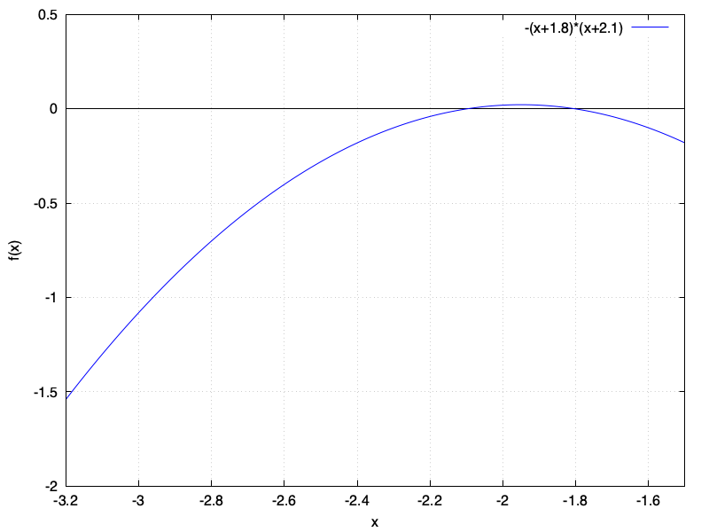
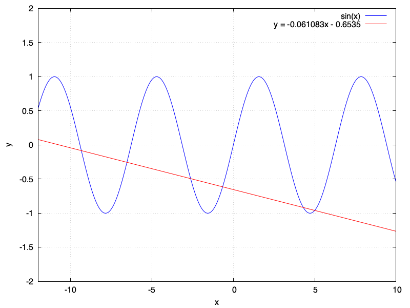
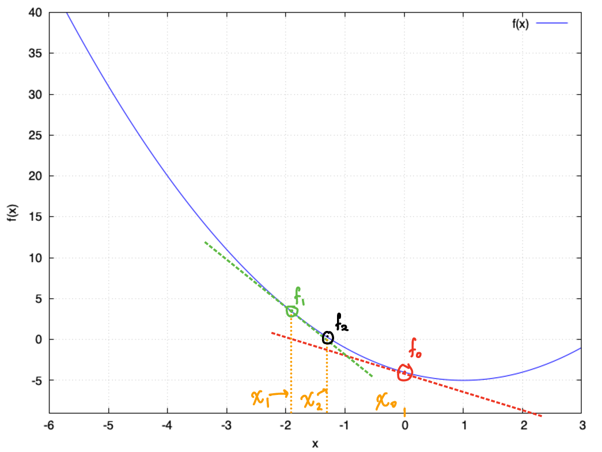

---
---

# HW 6 Solutions

* Table of Contents
{:toc}

## Summary

**Due Date**: Tue, Oct 21 at midnight   
**What to submit**:  
- A PDF file for problem 1.1, 1.2, 2.1, 2.3, 3.1, and 3.2
- A Python file for problem 1.3, titled bisection.py
- A Python file for problem 2.2, titled secant.py
- A Python file for problem 3.3, titled newton.py  
**Where to submit**:  
- Code at [this link](https://moodle.swarthmore.edu/mod/lti/view.php?id=768200)
- PDF at [this link](https://moodle.swarthmore.edu/mod/lti/view.php?id=768201)

## (1) The Bisection Algorithm

### (1.1) Working out the successive brackets *by hand*
The bisection algorithm works by successively `bracketing' the root between a lower bound and an upper bound, i.e., a left edge and a right edge. If we use the bisection algorithm on the function $$ f(x) = (x+\pi)(x-\pi/2)(x-5)$$ starting with the bracket $[-4,-3]$,
* what will be the next six brackets predicted by the algorithm? Arrange your answer neatly in a table similar to the one developed in class.
* Explain how many steps it will take to bracket the root within an interval of size $1 \times 10^{-6}$.

**Note:** You should not use a computer to solve this problem. It's okay to use a calculator, though!

**Solution**

The bisection algorithm for this problem can be summarized in the following table:

| $[x_1, \quad \qquad \qquad x_3, \qquad \qquad \quad x_2]$                  | $[f(x_1), \quad f(x_3), \quad f(x_2)]$                     | Next bracket   |
|----------------------------------------------------------------------------|------------------------------------------------------------|----------------|
| $[-4.0000000, \, -3.5000000, \,-3.0000000]$                                | $[-43.0, \quad -15.4, \quad +5.18 ]$                       | right bracket  |
| $[-3.5000000, \, -3.2500000, \,-3.0000000]$                                | $[-15.4, \quad -4.31, \quad +5.18 ]$                       | right bracket  |
| $[-3.2500000, \, -3.1250000, \,-3.0000000]$                                | $[-4.31, \quad +0.63, \quad +5.18 ]$                       | left bracket   |
| $[-3.2500000, \, -3.1875000, \,-3.1250000]$                                | $[-4.31, \quad -1.79, \quad +0.63 ]$                       | right bracket  |
| $[-3.1875000, \, -3.1562500, \,-3.1250000]$                                | $[-1.79, \quad -0.56, \quad +0.63 ]$                       | right bracket  |
| $[-3.1562500, \, -3.1406250, \,-3.1250000]$                                | $[-0.56, \quad +0.04, \quad +0.63 ]$                       | right bracket  |
| $[-3.1562500, \, -3.1484375, \,-3.1406250]$                                | $[-1.26, \quad -0.26, \quad +0.04 ]$                       | right bracket  |

To bracket a root within an interval of size $1 \times 10^{-6}$, we recall that for an initial bracket size of $\Delta x$, the interval size after $n$ steps is $\varepsilon$, where $\varepsilon$ is given by $$\varepsilon = \frac{\Delta x}{2^n}.$$ Here, $\Delta x = 1$ because the initial interval is from $-4$ to $-3$. Thus, we have $$1 \times 10^{-6} = \frac{1}{2^n} \implies 2^n = \frac{1}{10^{-6}},$$ and using logarithms on both sides, we get $$n \log 2 = 6 \log 10 \implies n \approx 19.9.$$ Therefore, 20 steps will be needed.

### (1.2) Choice of initial bracket
Using hand-calculations and a simple calculator, explain how the bisection algorithm will behave when initialized with each of the following brackets. For each case, indicate whether or not it will converge on a solution, and if so, which root it will converge on.

    You should not use a computer to solve this problem. It's okay to use a calculator, though!

* You start with the bracket $[-4,-2]$
* You start with the bracket $[-4,+2]$
* You start with the bracket $[-4,+6]$
* You start with the bracket $[0,+4.9]$
* You start with the bracket $[+2,+4]$

You may answer these questions with the help of a graph of the given function, shown below.

**Solution**

* You start with the bracket $[-4,-2]$
	* This interval`brackets' the root $ x = - \pi$, and the algorithm will eventually converge on this root.
* You start with the bracket $[-4,+2]$
	* This interval cannot work because $f(-4)$ and $f(+2)$ both have the same sign. The algorithm has no way of deciding which half of the interval to proceed with.
* You start with the bracket $[-4,+6]$
	* This interval brackets multiple roots, but $f(-4)$ and $f(+6)$ have different signs, so it is a valid initial bracket. The midpoint of this interval is $x = +1, and we note that $f(+1)$ has a positive sign. Thus, the next bracket chosen will be the left-side half, i.e., $[-4,+1]$. This brackets the root $x = - \pi$, and the algorithm will eventually find that root.
* You start with the bracket $[0,+4.9]$
	* This interval brackets the root $x = \pi/2$, and the algorithm will eventually converge on this root.
* You start with the bracket $[+2,+4]$
	* This interval does not bracket any root, so it is not a valid starting interval. No root will be found.

### (1.3) A Python program for bisection

Complete the in-class activity with the bisection method, i.e., finish writing the program found at [this link](../Resources/#lec-61-tue-oct-7bisection_algorithm.py).

**Solution**

~~~python
import math
from numpy import sign, cos, pi, exp, sin

def bisection(f,x1,x2,tol):
    # Carries out the bisection algorithm for the function f, using the
    # bracket (x1,x2) with a 'tolerance' of tol.
    f1 = f(x1)
    f2 = f(x2)
    if sign(f1) == sign(f2):
        # if the sign of f(x1) and f(x2) is the same,
        # there is probably no root between x1 and x2.
        print('Root is not bracketed between x1 and x2')
        return None
    
    er = 1 # some large value
    iters = 0
    while er > tol:
        iters+=1
        # uncomment the following line for debugging purposes
        # print(f'Root is between x1 = {x1:.3f} and x2 = {x2:.3f}')
        x3 = 0.5*(x1 + x2)
        f3 = f(x3)
        
        if f3 == 0.0:
            return x3
        if sign(f3) == sign(f2):
            x2 = x3
        else:
            x1 = x3
        er = abs(x1-x2)
    return 0.5*(x1 + x2), iters
~~~

## (2) The Secant Method
In class, we learned how to implement the secant method to find the roots of a given function $f(x)$, starting with two estimates of the root.

### (2.1) Illustrating the secant method
Using the following image, graphically illustrate two steps of the secant method, starting with the pair of estimates, $x_1 = -3.0$ and $x_2 = -2.7$. In your solution, you should print out (or otherwise reproduce) the figure below, and should accurately determine, with the help of a straight edge and pencil, the next two estimates of the root.

A complete illustration will contain four labeled points: $(x_1,f_1)$, $(x_2,f_2)$, $(x_3,f_3)$, and $(x_4,f_4)$, together with any other points that were necessary in order to find these four points. It should also contain straight lines connecting the points in the manner demonstrated in class. For each straight line shown, you should write down the equation of the straight line in the form of $y = mx+c$, where $m$ and $c$ are replaced with numbers precise up to two decimal places.

Include with your figure a written explanation of the steps that you took. This does not need to be very detailed, but you should expect to write at least a few sentences.

**Solution**

The first straight line is through the points $(x_1,f_1)$ and $(x_2,f_2)$, shown in red in the diagram below. To find $f_j$, we just need to evaluate the function $f(x_j) = -(x_j+1.8)(x_j+2.1)$ as given in the problem. We therefore find

$$(x_1,f_1) = (-3.0,-1.08) \\ (x_2,f_2) = (-2.7,-0.54),$$

where the gradient of the straight line can be found using $$m = \frac{y_2-y_1}{x_2-x_1} = 1.8.$$

Then, the straight line drawn in red in the figure has the equation $y = 1.8x+c$. We can then find the $y$-intercept, $c$, by plugging in one of the points:

$$-1.08 = 1.8 \times (-3.0) + c \implies c = 4.32.$$

Thus, the equation of the straight line in red is $$y = 1.8x + 4.32.$$

This line intersects the $x$ axis at $y = 0$, i.e., when $x = \frac{-4.32}{1.8}.$ This point is labeld $x_3 = -2.4$ in the diagram. Evaluating the function $f$ on this new value of $x$, we start the process again. This time, we use the two points

$$(x_2,f_2) = (-2.7,-0.54) // (x_3,f_3) = (-2.4,-0.18)$$

to draw a straight line. We find that the equation of this straight line, drawn in green here, is

$$y = 1.2x + 2.7$$

and it intersects the $x$ axis at the point $x_4 = -2.25$. Applying the function $f$ to this point, we can label $(x_4,f_4) = (-2.25,-0.06725)$. The secant method can then be continued from here.

### (2.2) A Python program for the secant method

**Note:** You may wish to use the Python program for the bisection method, included in the files for lecture 11, as a template.

Write a Python program that uses the secant method to find the root of a function. Your program should take the following arguments:
* A function, whose root is to be found.
* `x1`, one estimate of the root
* `x2`, another estimate of the root
* `n`, the number of steps of the secant method that are to be carried out.

After each iteration, your program should 'forget' the estimate named `x1`; you do not need to calculate which estimate should be forgotten.

Your function should return the most recently calculated estimate of the root.

**Tip:** You may be tempted to store all subsequent values of $x$ that arise in the course of iterating the secant method. I strongly recommend that you avoid doing this. It's a good idea to write your program in such a way that you only store what you absolutely must. However, if you cannot think of a way to do this problem without storing all past values of $x$, you may ignore this advice.

**Testing out your code**

In class, we tested out our root-finding code using the function `numpy.cos`. This is because we know that this function has a root at $\pi/2$. Feel free to use this function to test out your code. However, you can also write your own test function. For example, you could define the following test function:

~~~python
def f_test(x):
    y = x ** 2 - 2*x - 4
    return y
~~~

and then pass `f_test` to your root-finding program. The result should be either $x \approx -1.236$ or $x \approx 3.236$.

**Solution**

~~~python
def secant(f,x1,x2,n):
    # Finds a root for the function "f", starting with two estimates
    # x1 and x2.
    f1 = f(x1)
    f2 = f(x2)
    for j in range(n):
        # Implement equation on slide 11 of Lecture 12.
        x3 = x1 - f1*(x2-x1)/(f2-f1)

        # forget x1, re-assign names.
        x1 = x2
        x2 = x3
        f1 = f2
        f2 = f(x3)
    return x3
~~~

### (2.3) Troubleshooting the secant method

**Tip:** For this part, you should have a working Python program that implements the secant method for `n` steps.

1. Use your Python function to determine a root for the function $f(x) = \sin(x)$ starting with the estimates $x = 4.3$ and $x=5.0$, using only a *single* iteration of the secant method. Comment on the answer that was found, and make a plot or sketch of the function $f(x)$, together with the straight line that was used by your program to arrive at this result.
2. Use your Python function to determine a root for the function $f(x) = \sin(x)$ starting with the estimates $x = 4.3$ and $x = 5.0$, using exactly *two* iterations of the secant method. Do this in two ways: (1) By passing `x1 = 4.3` and `x2 = 5.0`, and (2) by passing `x1 = 5.0` and `x2 = 4.3`. For both cases, use `n=2`. Report the results that are given by your Python program, and comment on why they are the way that they are.
3. Repeat 2, but this time using 7 iterations instead of 2. Comment on the results.

**Solution**

Using the Secant method *once* on the function $f(x) = \sin(x)$ implies finding the point where the following straight line intersects the $x$ axis, which is close to $x = -10$. This is indeed what happens if you run your code for one iteration.

1. A single iteration
~~~
>>> from math import sin
>>> secant(sin,4.3,5.0,1)
-10.69862218730874
~~~

2. Two iterations.
~~~
>>> from math import sin
>>> secant(sin,4.3,5.0,2)
-2.8603422968182874
~~~

~~~
>>> from math import sin
>>> secant(sin,5.0,4.3,2)
-3.038835859994216
~~~

These two are different because the program always 'forgets' the variable `x1`.

3. Seven iterations

~~~
>>> from math import sin
>>> secant(sin,4.3,5.0,7)
-3.1415926301389754
~~~

~~~
>>> from math import sin
>>> secant(sin,5.0,4.3,7)
-3.1415926301389754
~~~

These two are the same; in the long run it doesn't matter which one is dropped.

## (3) Newton's Method

In class, we learned how to implement Newton's method to find the roots of a given function $f(x)$, starting with a single estimate of the root. We also learned that, in order to implement this method, we need to be able to evaluate both $f(x)$ for any $x$, *and* evaluate $f'(x)$ for any $x$.

### (3.1) Illustrating Newton's Method

Using the following image, graphically illustrate two steps of Newton's method on the function $f(x) = x^2 -2x -4$, starting with the estimate that $x_0 = 0.0$ is the location of the root. This is not correct, but Newton's method will improve this estimate. In your solution, you should print out (or otherwise reproduce) the figure below, and should accruately determine, with the help of a straight edge and pencil, the next two estimates of the root.

A complete illustration will contain three illustrated points: $(x_0,f_0)$, $(x_1,f_1)$, and $(x_2,f_2)$, together with any other points that were necessary in order to find these three points. It should also contain straight lines as needed, as demonstrated in class.

**Hint:** You have to use the idea of a *tangent* to successfully execute this problem. There will be some variable human judgement in determining tangents; that's okay.

**Solution**

This problem can be solved using an illustration of the kind shown below.

### (3.2) Thinking about gradients

1. For the same function illustrated above, $f(x) = x^2 - 2x - 4$, assume that Newton's method was being initiated starting from $x_0 = -4$. What is the value of the gradient of $f(x)$ evaluated at $x_0$ ?
2. What is the equation of the straight line that would be used to advance Newton's method starting at $x = -4$ ? Use the form $y = mx+c$, and replace $m$ and $c$ with their respective values.
2. When a Python program is written for Newton's method, the program takes as input two functions (among other things). What two Python functions would you have to pass to `newton_n` in order to find a root of the above function, $f(x) = x^2 - 2x - 4$ ? Write down these functions, 'by hand'. Use proper Python syntax, including the `def` and `return` keywords.

**Solution**

1. This question can be answered by noting that if $f(x) = x^2 - 2x -4$, then $f'(x) = 2x -2$. Evaluating this at $x = -4$ gives $-10$. Thus, $f'(x_0) = -10$.
2. We have already determined the gradient $m$ of this straight line. We now need to calculate $c$, the $y$ intercept. $$y = -10x + c.$$ Substituting $x_0 = -4, we find that $y_0 = f(x_0) = 20$. Thus, we have $$ 20 = -10 \times -4 + c \implies c = 34.$$ Thus, the equation of the straight line should be $$y = -10 x + 34.$$
3. The two functions that will need to be passed are:

~~~python
def f(x):
    return x**2 - 2*x - 4

def dfdx(x):
    return 2*x - 2
~~~

### (3.3) A Python program for Newton's method

Write a Python function that implements Newton's method for `n` iterations. Your function will look like this:

~~~python
def newton_n(f,derivative_of_f,x0,n):
    # Carries out n iterations of Newton's method to
    # find the root of the function f, starting from
    # the estimate x0.
    # ...
    return 0.0
~~~

and it should return the most recent estimate of the root of `f`.

**Solution**

It is possible to write an extremely terse program for Newton's method.

~~~python
def newton_n(f,df,x0,n):
    x_current = x0
    for i in range(n):
        # Implement equation on slide 16 of lecture 12
        x_new = x_current - f(x_current)/df(x_current)
        x_current = x_new
    return x_new
~~~


