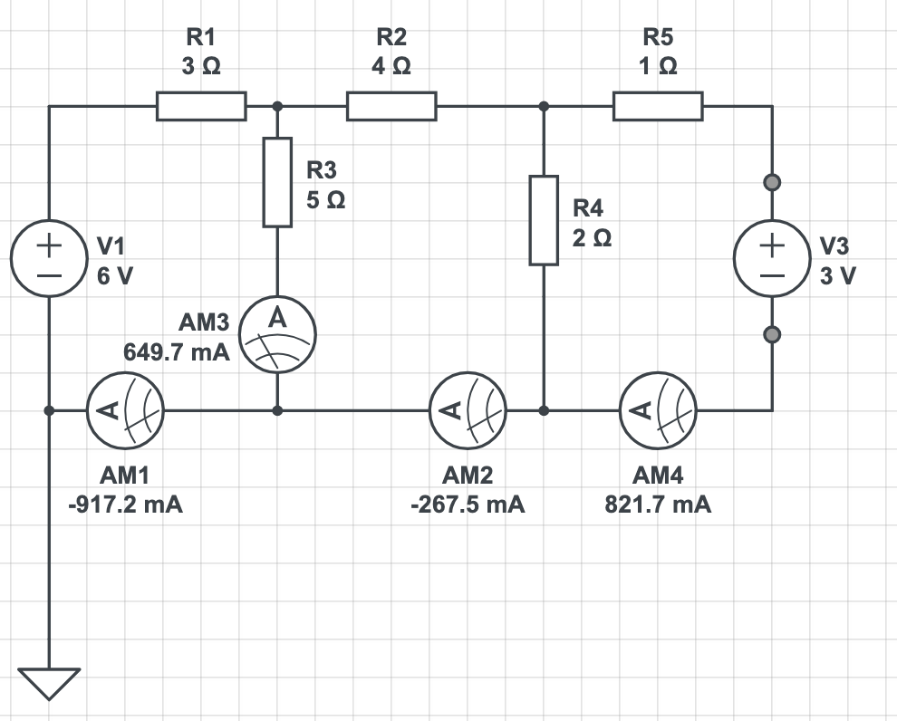

---
---

# HW 7 Solutions

* Table of Contents
{:toc}

[HW 7 Questions](HW7)

## (1) Gaussian Elimination in Python

In this problem, you will write a program that solves a linear system of equations using Gaussian elimination followed by forward substitution. Turn in both functions that you write in a **single** python file called `GaussianElimination.py`.

### (1.1) Forward Elimination

~~~python
import numpy as np
def forward_elimination(A,b):
    # A is a square matrix of size N x N,
    # e.g., [[1,2,3],[1,4,5],[0,1,2]]
    # b is a column vector of size N x 1
    # e.g., [[-1],[5],[7]]
    # Function returns augmented matrix [A | b]

    # Determine the size of the system
    N = len(b)

    # Implement conditions on the size/shape of the input matrices
    if len(A[0,:]) != len(A[:,0]) or len(b) != len(A[0,:]):
        print('Size of A and/or b is not correct')
        return None
    
    # Build augmented matrix
    Ab = np.concatenate((A,b),axis=1)

    for column in range(N-1): # loops thru all but last column
        # The index of current column is "column".
        for row in range(column+1,N): # for column j, start from row number j+1
            # The "multiplier" has A_jj in the denominator
            # when eliminating column j. In the numerator, it has A_kj 
            # where k is the current row number.
            multiplier = Ab[row,column]/Ab[column,column]
            Ab[row,:] = Ab[row,:] - multiplier * Ab[column,:]
    return Ab
~~~

### (1.2) Backward Substitution

~~~python
import numpy as np
def backward_substitution(Ab):
    # Input is a N x (N+1) matrix
    # output is a column vector of size N x 1

    # Get the size of the matrix
    N,M = np.shape(Ab)

    # 'unpack' the augmented matrix:
    A = Ab[:,0:N]
    b = Ab[:,-1]

    # Initialize your 'x' vector that will contain your solution
    x = np.zeros((N,1))

    # Backward substitution:
    for row in range(N-1,-1,-1):
        x[row] = b[row] - np.dot(A[row,row+1:],x[row+1:])/A[row,row]
    return x
~~~

## (2) Gaussian Elimination by hand

<embed src="GaussianElimination-solution.pdf" width="500" height="375" 
 type="application/pdf">

## (3) The condition number.

The matrix-vector equation $$\begin{bmatrix} 4.1 & 2.8 \\ 9.7 & 6.6 \end{bmatrix} \cdot \begin{bmatrix} x_1 \\ x_2 \end{bmatrix} = \begin{bmatrix} 4.1 \\ 9.7 \end{bmatrix}$$ has the solution $$\begin{bmatrix} 1 \\ 0 \end{bmatrix}.$$

If the above problem is repeated with a small difference to the right-hand side, i.e., $$\begin{bmatrix} 4.1 & 2.8 \\ 9.7 & 6.6 \end{bmatrix} \cdot \begin{bmatrix} x_1 \\ x_2 \end{bmatrix} = \begin{bmatrix} 4.11 \\ 9.7 \end{bmatrix},$$ we find that the solution to this new equation is now $$\begin{bmatrix} 0.34 \\ 0.97 \end{bmatrix}.$$

This behavior can be explained by the **condition number** of this matrix. In class, we learned that the condition number of a matrix is equal to $$||A|| \cdot ||A^{-1}||,$$ i.e., it equals the norm of the matrix multiplied by the norm of its inverse. In this problem, $||A|| = 12.74$ and $||A^{-1}|| = 127.4$, so their product is $1,623$, a number that is much greater than $1$. Therefore, the matrix $A$ is ill-conditioned. Another way to see this is to notice that the determinant of the matrix, $|A|$, which is equal to $-0.1$, is much less than the norm $||A||$.

The matrix $A$ has a large condition number and is therefore **ill-conditioned**. This explains the fact that a tiny change of $0.01$ in the right-hand side of the equation $Ax=b$ makes a very large difference to the solution.

Consider the matrix $$\begin{bmatrix} 4.1 & 2.8 \\ 9.7 & 6.6 \end{bmatrix},$$ and the right-hand side vector $$\begin{bmatrix} 4.1 \\ 9.7 \end{bmatrix}.$$

## (4) Using linear systems to solve circuits

The ammeter readings in the following circuit can be considered to be the solution to a linear system of equations. Write out this system of equations by hand using Kirchhoff's Laws, and then use your Gaussian elimination and backward substitution programs to verify the four ammeter redings shown in the following circuit diagram.

Turn in your code, including appropriate print statements so that the graders can verify your work.


