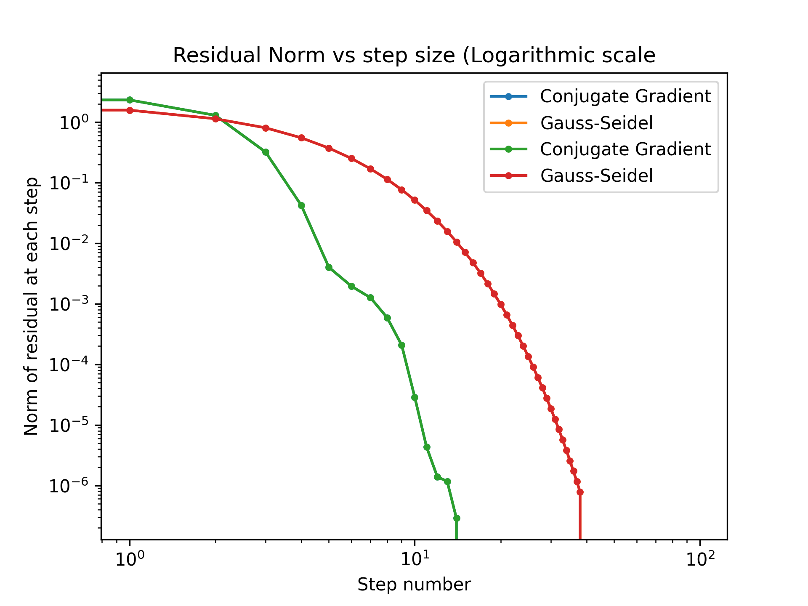

---
---

# HW 8 Solutions

* Table of Contents
{:toc}

[HW 8 Questions](HW8)

## (1) LU Decomposition

<embed src="LUdecomp-filled.pdf" width="500" height="375" 
 type="application/pdf">

## (2) Gauss-Seidel Method: an iterative approach to solving $Ax=b$

~~~python
from numpy import dot
from numpy.linalg import norm

def GaussSeidelv1(A,b,x0,tol=1e-6):
    x = x0.copy()		    # best to work on a "copy"
    n = len(A)
    while True:
        for i in range(n):          # i is the row number
            x[i] = b[i]/A[i,i]      # not done yet! we'll keep updating
            for j in range(n):
                if i != j:
                    x[i] -= (A[i,j]*x[j])/A[i,i]
        r = b - dot(A,x) # residual
        
        if norm(r) < tol:
            break
    return x

~~~

## (3) Gradient-based methods

### 1) Compare number of steps

~~~python
from numpy import dot, loadtxt, zeros
from numpy.linalg import norm
from numpy import transpose as tr

def GaussSeidelv2(A,b,x0,tol=1e-6):
    x = x0.copy()		    # best to work on a "copy"
    n = len(A)
    numSteps = 0
    while True:
        numSteps += 1
        for i in range(n):          # i is the row number
            x[i] = b[i]/A[i,i]      # not done yet! we'll keep updating
            for j in range(n):
                if i != j:
                    x[i] -= (A[i,j]*x[j])/A[i,i]
        r = b - dot(A,x) # residual
        # print("Done with one step. Res = ",norm(r))
        
        if norm(r) < tol:
            break
    print(f"Gauss-Siedel took {numSteps} steps")
    return x

def conjugate_gradientv2(A,b,x_guess,tol=1e-6):
    # Uses the conjugate gradient method to solve Ax=b within tolerance specified by 'tol'.
    x = x_guess.copy()
    r = b - dot(A,x)
    beta = 0
    s = r.copy()
    numSteps = 0

    while 2+2 == 4:
        numSteps += 1
        a = dot(tr(s),r)/(dot(dot(tr(s),A),s))  # step size alpha
        x = x + a*s                             # update x
        r = b - dot(A,x)                     # calculate residual
        if norm(r) <  tol:
            break
        beta = - (dot(dot(tr(r),A),s)/
                  (dot(dot(tr(s),A),s)))        # step size beta
        s = r + beta*s                          # update search direction
    print(f"Conjugate Gradient took {numSteps} steps")
    return x

# Test on given problem
A = loadtxt('test_A.txt')
b = loadtxt('test_B.txt')

# Start Gauss-Seidel with a guess of zeros
GaussSeidelv2(A,b,zeros(len(b)))

# Start Conjugate Gradient with a guess of zeros
conjugate_gradientv2(A,b,zeros(len(b)))

~~~

The output of the above program is:

~~~
Gauss-Siedel took 39 steps
Conjugate Gradient took 15 steps
~~~

### 2) Modify code so that the norm of the residual is reported

~~~python
from numpy import dot, loadtxt, zeros, trim_zeros
from numpy.linalg import norm
from numpy import transpose as tr

def GaussSeidelv3(A,b,x0,tol=1e-6):
    x = x0.copy()		    # best to work on a "copy"
    n = len(A)
    numSteps = 0
    norm_residuals = zeros(100) # or some large number.
    while True:
        numSteps += 1
        for i in range(n):          # i is the row number
            x[i] = b[i]/A[i,i]      # not done yet! we'll keep updating
            for j in range(n):
                if i != j:
                    x[i] -= (A[i,j]*x[j])/A[i,i]
        r = b - dot(A,x) # residual
        norm_residuals[numSteps-1] = norm(r)
        # print("Done with one step. Res = ",norm(r))
        
        if norm(r) < tol:
            # No need to store more numbers, so "trim" the zeros.
            trim_zeros(norm_residuals)
            break
    return x,norm_residuals

def conjugate_gradientv3(A,b,x_guess,tol=1e-6):
    # Uses the conjugate gradient method to solve Ax=b within tolerance specified by 'tol'.
    x = x_guess.copy()
    r = b - dot(A,x)
    beta = 0
    s = r.copy()
    numSteps = 0
    norm_residuals = zeros(100)
    while 2+2 == 4:
        numSteps += 1
        a = dot(tr(s),r)/(dot(dot(tr(s),A),s))  # step size alpha
        x = x + a*s                             # update x
        r = b - dot(A,x)                     # calculate residual
        norm_residuals[numSteps-1] = norm(r)
        if norm(r) <  tol:
            # No need to store more numbers, so "trim" the zeros.
            trim_zeros(norm_residuals)
            break
        beta = - (dot(dot(tr(r),A),s)/
                  (dot(dot(tr(s),A),s)))        # step size beta
        s = r + beta*s                          # update search direction
    return x,norm_residuals
~~~

### 3) Plot the norm of the residual vs. the step number (linear)

### 4) Plot the norm of the residual vs. the step numnber (log)


